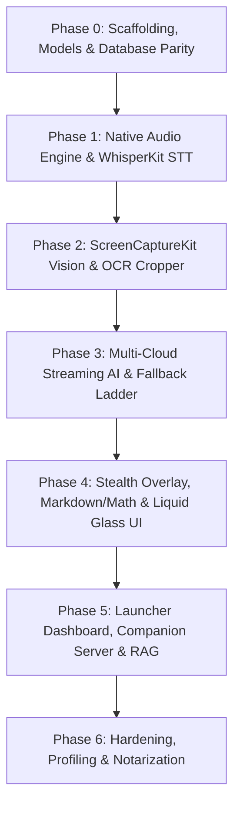

# Natively macOS: Transformation Plans & Architectural Blueprints

This directory contains the complete specifications, phase breakdown, and architectural designs for transforming Natively from an Electron application into a 100% native macOS (macOS 15+ Sequoia) application.

These plans are intended for human developers, collaborators, and autonomous AI agents working on the codebase.

---

## Roadmap Overview

---

## Plan Directory

| Document | Scope | Status | Key Technologies |
| :--- | :--- | :--- | :--- |
| **[Master Plan](master-transformation-plan.md)** | Full transformation strategy, metrics, performance benchmarks, and phased roadmap | Active Master | Swift 6, AppKit, SwiftUI, Metal, CoreML |
| **[Phase 0 Plan](master-transformation-plan.md#phase-0-scaffolding-models--database-parity)** | Swift Package structure, schema parity with `natively.db`, GRDB migrations, and Keychain migration | **Completed** (`d026bc1`) | GRDB.swift, Security.framework, SQLite3 |
| **[Phase 1 Plan](phase-1-native-audio-whisperkit-plan.md)** | Dual-channel audio engine (Mic + System Loopback via ScreenCaptureKit), Accelerate vDSP VAD, WhisperKit CoreML on Neural Engine | **Completed** (`78e3ed9`) | AVAudioEngine, ScreenCaptureKit Audio, WhisperKit, Accelerate |
| **[Phase 2 Plan](phase-2-screencapturekit-vision-cropper-plan.md)** | Sub-15ms ScreenCaptureKit screenshot, VNRecognizeTextRequest OCR on Neural Engine, interactive cropper panel with `sharingType = .none` | **Completed** (`e32be66`) | ScreenCaptureKit, Vision.framework, AppKit NSPanel |
| **[Phase 3 Plan](phase-3-multi-cloud-streaming-ai-fallback-plan.md)** | Multi-cloud SSE streaming engine (Claude 3.5 Sonnet, GPT-4o, Gemini, Groq, DeepSeek, Ollama), TTFT 4.0s fallback ladder, and prompt compiler | **Completed** (`93bf085`) | URLSession SSE, Actor Concurrency, Circuit Breaker |
| **[Phase 4 Plan](phase-4-stealth-overlay-markdown-math-ui-plan.md)** | Hardware stealth NSPanel (`sharingType = .none`), custom non-rectangular hit-testing, pure Swift Markdown, syntax highlighting, LaTeX math, and Carbon global hotkeys | **Completed** (`b799c31`) | NSPanel, SwiftUI, AttributedString, Carbon HIToolbox |
| **[Phase 5 Plan](phase-5-launcher-dashboard-companion-rag-plan.md)** | Native Launcher meeting history dashboard, Network.framework companion micro-server (port 4123), and Accelerate-powered vector RAG | **Current Phase** | SwiftUI SplitView, Network.framework, Accelerate vDSP |

---

## Development Constraints & Rules

1. **Local Commits Only**:
   - Strictly perform local git commits (`git commit`).
   - **NEVER execute `git push`** under any circumstances.
2. **Conventional Commits**:
   - `feat(scope): ...`
   - `fix(scope): ...`
   - `refactor(scope): ...`
   - `test(scope): ...`
3. **Target Platform**:
   - macOS 15.0+ (Apple Silicon arm64).
   - Compiler: Swift 6 with strict concurrency checking.
4. **Hardware-Level Stealth Guarantee**:
   - All overlay and crop windows must maintain `sharingType = .none` to prevent detection or display in screen-sharing applications (Zoom, Teams, Google Meet, ScreenCaptureKit, QuickTime).
