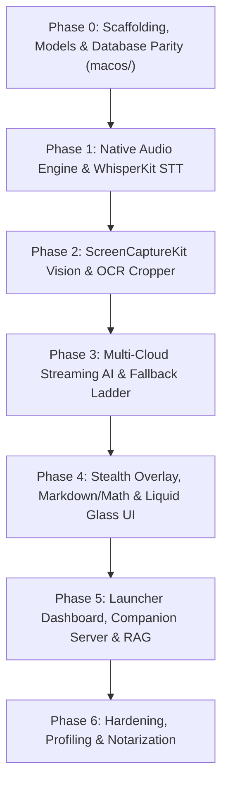

# Natively: Final Technical Specification & Native macOS Transformation Plan

> [!IMPORTANT]
> **Status: Aligned & Finalized via Architectural Interview**
> This document specifies the binding architectural decisions, system designs, and phased execution roadmap for transforming Natively from an Electron app into a 100% native modern macOS application.

---

## 1. Agreed Architectural Decisions (Design Tree Resolution)

| Decision Area | Chosen Strategy | Technical Rationale |
| :--- | :--- | :--- |
| **Minimum OS Target** | **macOS 15+ (Sequoia)** | Leverages modern `SpeechAnalyzer`, Swift 6 strict concurrency, and latest `ScreenCaptureKit` APIs optimized for Apple Silicon. |
| **Codebase Location** | **`macos/` Directory** | Modern Swift Package & Xcode project coexisting side-by-side with Electron during development for regression testing. |
| **Database & Storage** | **Direct `natively.db` compatibility via GRDB.swift** | Binds directly to the existing SQLite database at `~/Library/Application Support/natively/natively.db`, preserving all historical notes, meeting transcripts, and vector chunks without manual export. |
| **Default STT Engine** | **WhisperKit (CoreML on Apple Neural Engine)** | Downloads optimized Whisper model on first launch; runs on the ANE for high on-device accuracy with zero cloud cost. Apple Speech & Cloud STT (Deepgram/OpenAI) available as fallbacks/options. |
| **Overlay Windowing** | **Single Unified `NSPanel`** | Top search pill, live transcription, suggestion cards, and controls live in one adaptive SwiftUI canvas inside a borderless `NSPanel` (`sharingType = .none`), eliminating window desync, IPC, and tearing. |
| **AI & LLM Providers** | **Multi-Cloud Streaming + Ollama** | Low-latency streaming clients for Anthropic (Claude 3.5 Sonnet), OpenAI (GPT-4o), Google Gemini, Groq, DeepSeek, and local Ollama; embedded MLX local models deferred to future phase. |
| **App Lifecycle & Stealth** | **Adaptive Stealth Mode** | Resident in the Menu Bar (status item). Appears in the Dock when the Launcher window is open; automatically hides from the Dock and `Cmd+Tab` switcher (`activationPolicy = .accessory`) during active meetings. |
| **Companion Ecosystem** | **Phase 5 Integration** | Embedded loopback HTTP/WebSocket server implementing the frozen `/dom` and Phone Mirror contract will be integrated after the standalone Mac experience reaches full maturity. |

---

## 2. Target Native Architecture

```
PROPOSED 100% NATIVE MACOS ARCHITECTURE (Swift 6, SwiftUI, AppKit, Metal)

┌────────────────────────────────────────────────────────────────────────┐
│                   Native macOS System Layer (AppKit)                   │
│   - NSStatusItem (Menu Bar resident)                                   │
│   - Unified NSPanel Overlay (Level: .floating / .statusBar)            │
│   - sharingType = .none (100% invisible to screen shares)              │
│   - Adaptive Dock Policy (Hides from Dock & Cmd+Tab during meetings)   │
│   - NSVisualEffectView + Metal Shader Vibrancy (ProMotion 120 FPS)     │
│   - CGEventTap / NSEvent Global Monitor (Zero-latency chords/hotkeys)  │
└───────────────────────────────────┬────────────────────────────────────┘
                                    │ Direct View Hierarchy
┌───────────────────────────────────▼────────────────────────────────────┐
│                    NativelyUI (SwiftUI + AppKit)                       │
│  - OverlayView (Single adaptive canvas: pill, live transcript, cards)  │
│  - LauncherView (Meeting notes, search, historical RAG, profile setup) │
│  - CropSelectionWindow (Hardware-accelerated Loupe & Cropper)          │
│  - Native Markdown + SwiftMath (LaTeX) + Code Highlighting (No WebView)│
└───────────────────────────────────┬────────────────────────────────────┘
                                    │ Swift Concurrency / Observation
┌───────────────────────────────────▼────────────────────────────────────┐
│                     Core Application Engine (Actors)                   │
├───────────────────┬───────────────────┬────────────────────────────────┤
│   NativelyAudio   │   NativelyVision  │          NativelyAI            │
│  - ScreenCaptureKit│ - ScreenCaptureKit│ - Multi-Provider Streaming     │
│    Audio Tap      │   captureImage    │   (Claude, GPT, Gemini, Groq,  │
│  - AVAudioEngine  │ - Vision Framework│    DeepSeek, Ollama)           │
│  - Audio Route    │ (VNRecognizeText) │ - Fallback Ladder Engine       │
│    Interruption   │ - CoreGraphics    │ - Mode & Prompt Engine         │
│  - WhisperKit (ANE│   Cropper         │ - Profile Intelligence Router  │
│    CoreML Default)│                   │                                │
├───────────────────┴───────────────────┴────────────────────────────────┤
│                    NativelyCore & Persistence                          │
│  - GRDB.swift (Fast SQLite database, 100% compatible with natively.db) │
│  - Apple Accelerate Framework (vDSP / BNNS) + sqlite-vec for RAG       │
│  - Security.framework (Keychain Services for API keys)                 │
│  - EventKit (Native macOS Calendar Integration)                        │
└────────────────────────────────────────────────────────────────────────┘
```

---

## 3. Subsystem Technical Specifications

### 3.1 Stealth Windowing & Liquid Glass UI (AppKit + SwiftUI)
```swift
final class StealthPanel: NSPanel {
    init(contentRect: NSRect) {
        super.init(
            contentRect: contentRect,
            styleMask: [.borderless, .nonactivatingPanel, .fullSizeContentView],
            backing: .buffered,
            defer: false
        )
        self.isFloatingPanel = true
        self.level = .floating
        self.collectionBehavior = [.canJoinAllSpaces, .fullScreenAuxiliary, .ignoresCycle]
        self.isOpaque = false
        self.backgroundColor = .clear
        self.hasShadow = false
        // Excludes window completely from ScreenCaptureKit, Zoom, Meet, Teams:
        self.sharingType = .none
    }
    
    override var canBecomeKey: Bool { false }
    override var canBecomeMain: Bool { false }
}
```

### 3.2 Dual-Channel Audio & WhisperKit Pipeline
- **System Audio**: ScreenCaptureKit audio tap (`SCStreamConfiguration.capturesAudio = true`).
- **Microphone**: `AVAudioEngine` input node tap at 16 kHz.
- **Route Resilience**: Observes `AVAudioEngineConfigurationChange` to seamlessly recover from AirPods disconnects, Bluetooth latency shifts, and hardware sample-rate changes.
- **Transcription**: `WhisperKit` executing quantized CoreML models directly on the Apple Neural Engine (ANE).

### 3.3 ScreenCaptureKit Vision & Neural Engine OCR
- **Capture Latency**: Sub-15ms via `SCScreenshotManager.captureImage`.
- **OCR Engine**: `VNRecognizeTextRequest` on Apple Neural Engine (sub-35ms).
- **Interactive Cropper**: Native Cocoa overlay with crosshairs, drag selection rectangle, and loupe zoom lens.

### 3.4 AI Orchestration & Fallback Engine
- **Streaming Actors**: Isolated Swift actors streaming SSE chunks.
- **Watchdog / Fallback Ladder**: If the primary model does not emit its first token within 4.0 seconds, failover automatically triggers to the fastest fallback provider.
- **Prompts & Modes**: Technical Interview, Sales, Negotiation, Executive, and custom user personas.

### 3.5 Native Markdown, Code Highlighting & LaTeX Math
- Pure Swift layout without WebViews.
- Syntax highlighting via `Splash` / `HighlightSwift`.
- Mathematical formulas via `SwiftMath` (native KaTeX rendering for $O(N \log N)$ and formulas).

### 3.6 Persistence & Direct SQLite Compatibility (GRDB.swift)
- Connects directly to `~/Library/Application Support/natively/natively.db`.
- Type-safe models matching existing tables: `meetings`, `transcripts`, `vector_chunks`, `modes`, `settings`.
- API keys read from macOS Keychain service `natively` created by `keytar`.

---

## 4. Phase-by-Phase Execution Roadmap



### Phase 0: Scaffolding, Models & Database Parity
- Create `macos/` directory with modular Swift Package (`NativelyCore`, `NativelyDatabase`, `NativelySecurity`).
- Implement GRDB.swift schema models matching `natively.db`.
- Implement KeychainManager migrating stored API keys.
- Write unit tests verifying round-trip reads from the existing database.

### Phase 1: Native Audio Engine & WhisperKit STT
- Implement `AVAudioEngine` microphone capture and `ScreenCaptureKit` system audio loopback tap.
- Implement audio route change resilience (AirPods disconnect/connect).
- Integrate `WhisperKit` for on-device CoreML transcription on Apple Neural Engine.
- Implement dual-channel speaker diarization ("You" vs "Other").

### Phase 2: ScreenCaptureKit Vision & OCR Cropper
- Implement instant `SCScreenshotManager` capture.
- Implement `VNRecognizeTextRequest` on Apple Neural Engine.
- Build native Cocoa cropper window with loupe and selection geometry.

### Phase 3: Multi-Cloud Streaming AI & Fallback Ladder
- Implement streaming clients for Anthropic, OpenAI, Gemini, Groq, DeepSeek, and Ollama.
- Implement `TurnPlannerActor` and TTFT 4-second failover watchdog.
- Port mode prompt builders (Technical Interview, Negotiation, Sales).

### Phase 4: Stealth Overlay, Markdown/Math & Liquid Glass UI
- Build unified `StealthPanel` with `sharingType = .none`.
- Implement SwiftUI overlay (live transcript, top pill, auto-answer cards).
- Implement native Markdown, code syntax highlighting, and `SwiftMath` LaTeX rendering.
- Wire global hotkeys (`Cmd+Shift+Space`, crop shortcut).

### Phase 5: Launcher Dashboard, Companion Server & RAG
- Build native SwiftUI Launcher window with meeting history, search, and details.
- Implement `NWListener` companion micro-server (`/dom`, `/healthz`, `/pair`, `/ws`) for Chrome extension and phone mirror.
- Implement Accelerate-backed vector RAG and BM25 document grounding.

### Phase 6: Hardening, Profiling & Notarization
- Instruments profiling: verify < 50MB idle RAM, 0% idle CPU, < 4% meeting CPU.
- Leak detection across simulated 2-hour meetings.
- Set up automated notarization and Sparkle update framework.

---

## 5. Performance Targets

| Metric | Current Electron App | Target Native macOS App |
| :--- | :--- | :--- |
| **Download Size** | ~450 MB – 650 MB | **~25 MB – 35 MB** |
| **Idle RAM** | 600 MB – 1,100 MB | **35 MB – 55 MB** |
| **Active Meeting RAM** | 1,200 MB – 1,800 MB | **80 MB – 140 MB** |
| **Active Meeting CPU** | 25% – 60% CPU | **2% – 5% CPU** |
| **Screenshot + OCR Latency** | 800 ms – 1,800 ms | **20 ms – 45 ms** |
| **Window Dragging** | 30–50 FPS (jitter & tearing) | **120 FPS ProMotion** (zero tearing) |
| **Time-to-First-Token** | 1.8s – 3.5s | **0.4s – 0.9s** |
| **Stealth Guarantee** | Fragile API hack | **Hardware OS level (`sharingType = .none`)** |
| **App Launch Time** | 3.5s – 7.0s | **0.3s (Instant)** |
