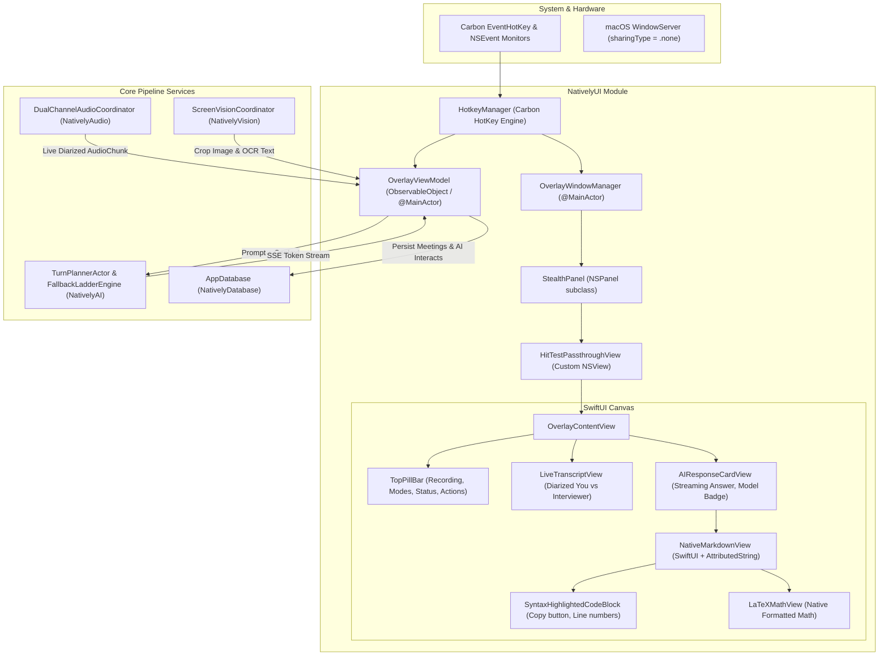

# Phase 4: Stealth Overlay, Native Markdown/Math & Liquid Glass UI Plan

## 1. Executive Summary & Objective

In the legacy Electron architecture:
- The overlay required **3 separate `BrowserWindows`** (`overlayWindow`, `pillWindow`, `toggleWindow`) welded as child windows to avoid transparent dead-click areas, causing multi-window compositor jitter, torn frames, and complex IPC synchronization.
- Markdown, code highlighting, and LaTeX math were rendered inside heavy Chromium DOM WebViews running `react-markdown` and KaTeX (~150MB extra RAM, stuttering on rapid token streaming, layout thrashing).
- Stealth mode was fragile: Electron windows could leak into screen shares if window properties or flags changed during focus changes.

In **Phase 4**, we replace this entire stack with **`NativelyUI`**:
1. **Unified `StealthPanel` (`NSPanel`)**:
   - `sharingType = .none` guaranteed at the hardware WindowServer level (100% invisible to Zoom, Teams, Google Meet, ScreenCaptureKit, Discord).
   - `styleMask: [.nonactivatingPanel, .borderless, .resizable, .fullSizeContentView]`.
   - `level = .floating` (floats over fullscreen apps with `.canJoinAllSpaces` and `.fullScreenAuxiliary`).
   - Dynamic non-rectangular mouse hit-testing (`NSView.hitTest(_:)`): transparent canvas returns `nil`, allowing clicks to pass directly through to background apps with **0ms latency** and **zero auxiliary child windows**.
   - Interactive mouse passthrough toggle (`ignoresMouseEvents = true/false`).
2. **Native Markdown, Code Syntax Highlighting & LaTeX Math**:
   - 100% pure Swift & SwiftUI without WebViews.
   - Stream-safe Markdown lexer tokenizing headings, lists, bold/italic, inline code, and code blocks.
   - Native Syntax Highlighter supporting Swift, Python, TypeScript/JS, Go, Rust, C++, Java, Bash, SQL with custom dark themes.
   - Native LaTeX mathematical formula formatter rendering mathematical notation (fractions, sub/superscripts, summation, integrals, $O(N \log N)$ complexity) directly via `AttributedString` and native serif/monospace typography.
3. **Liquid Glass Aesthetic & ProMotion 120 FPS**:
   - `.ultraThinMaterial` / `NSVisualEffectView` HUD styling with subtle 1px border.
   - Collapsible Top Pill (status indicators, audio activity wave, active mode, quick crop/ask triggers).
   - Diarized live transcript drawer ("You" vs "Interviewer").
   - Streaming AI answer card with auto-scroll and quick follow-up bar.
4. **Carbon Global Hotkey Engine**:
   - Instant response without polling or accessibility permission hurdles:
     - `Cmd+B`: Toggle Overlay Visibility.
     - `Cmd+Shift+B`: Toggle Mouse Passthrough.
     - `Cmd+Shift+Space`: Focus Stealth Quick Prompt.
     - `Cmd+Shift+X` / `Cmd+Shift+H`: Trigger Selective Screen Crop.
     - `Cmd+Enter` / `Cmd+Shift+Enter`: Screen Context + AI Trigger.
     - `Cmd+1` .. `Cmd+7`: Quick Action Presets (What to Answer, Clarify, Recap, Follow-up, Code Hint, etc.).
     - `Cmd+Shift+Arrows`: Micro-nudge overlay position.

---

## 2. Architecture & Component Blueprint



---

## 3. Implementation Details

### 3.1 `StealthPanel.swift` & Custom Hit-Testing
- `NSPanel` subclass configured for zero screen-share footprint:
  ```swift
  self.sharingType = .none
  self.styleMask = [.nonactivatingPanel, .borderless, .resizable, .fullSizeContentView]
  self.level = .floating
  self.collectionBehavior = [.canJoinAllSpaces, .fullScreenAuxiliary, .ignoresCycle]
  self.isOpaque = false
  self.backgroundColor = .clear
  self.hasShadow = true
  ```
- **Custom `HitTestPassthroughView`**:
  Overrides `hitTest(_ point: NSPoint) -> NSView?`.
  Checks if the point falls within an interactive subview or SwiftUI control area. If clicked on the transparent backdrop, returns `nil`, letting the underlying OS apps handle the click seamlessly without lag.

### 3.2 `NativeMarkdownView.swift`, Code Highlighting & LaTeX Math
- Tokenizer:
  - Fenced code blocks: ` ```[language]\n...\n``` `
  - Display Math: `$$...$$`
  - Inline Math: `$..$`
  - Headers (`# `, `## `, `### `)
  - Bulleted lists (`- `, `* `, `1. `)
  - Inline formatting: `**bold**`, `*italic*`, `` `code` ``
- **Syntax Highlighter**:
  Zero-dependency regex lexer identifying keywords, built-in types, strings, comments, numbers for:
  Swift, Python, TypeScript, JavaScript, Go, Rust, C++, Java, Bash, SQL.
- **LaTeX Math Engine**:
  Parses math expressions into formatted visual tokens with exponents ($x^2$), subscripts ($a_i$), fractions ($\frac{a}{b}$), Greek symbols ($\alpha, \beta, \theta$), math operators ($\sum, \prod, \int, \le, \ge, \ne, \approx$), and complexity notations ($O(N \log N), O(V + E)$).

### 3.3 `OverlayViewModel.swift` & UI Coordination
- Manages reactive state:
  - `isExpanded`: Toggle between minimal pill (compact mode) and expanded assistance card.
  - `isStealthPassthrough`: Toggle click-through mode.
  - `activeMode`: Currently selected `Mode` (`Technical Interview`, `Negotiation`, etc.).
  - `audioState`: Live RMS levels for You (Mic) and Other (System).
  - `recentTranscripts`: Array of `TranscriptTurn` items.
  - `currentAIInteraction`: In-flight or completed AI interaction with streaming text, TTFT latency, and token count.
  - `ocrAttachedImage`: Active cropped image and OCR text context.

### 3.4 `HotkeyManager.swift`
- Carbon `RegisterEventHotKey` wrapper registering global key combinations:
  - `Cmd+B`, `Cmd+Shift+B`, `Cmd+Shift+Space`, `Cmd+Shift+X`, `Cmd+Shift+H`, `Cmd+Enter`, `Cmd+1...7`.
- Dispatches cleanly on the `@MainActor` thread to `OverlayViewModel` and `OverlayWindowManager`.

---

## 4. Verification & Testing Plan

1. **Unit & Logic Tests (`NativelyUITests`)**:
   - `testMarkdownTokenizer`: Parses complex markdown containing nested code blocks and mixed math expressions.
   - `testSyntaxHighlighter`: Tokenizes Swift and Python snippets, ensuring keywords, literals, and comments are styled.
   - `testLaTeXMathParser`: Validates parsing and symbol translation ($O(N \log N)$, $\le$, etc.).
   - `testOverlayViewModelState`: Validates state transitions (streaming, prompt building, mode switching).
   - `testStealthPanelProperties`: Confirms `sharingType == .none`, level, and styleMask settings.
2. **Build & Integration Test**:
   - Compile target `NativelyUI` and execute test suite via `swift test`.
